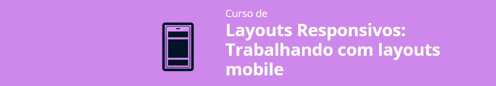

# projeto-apeperia

  

Este repositório é destinado ao projeto que desenvolvi com base nas aulas do "Curso de Layouts Responsivos: Trabalhando com layouts mobile", da Alura, focado em HTML e CSS. 

## APEPERIA:

O conteúdo deste curso é voltado exclusivamente para o desenvolvimento de uma página web.

Além disso, o foco do curso está no desenvolvimento com <b>responsividade</b>, bem como no estudo acerca de códigos semânticos, acessíveis e com adaptação a diferentes layouts.

**Objetivos principais:**

- Entender o processo de desenvolvimento de páginas web;
- Conhecer o Emmet, ferramenta para agilizar a escrita de códigos;
- Melhorar a manutenção de códigos com variáveis CSS;
- Escrever códigos semânticos que ajudam na acessibilidade e SEO;
- Aprender a lidar com adaptação de diferentes layouts;
- Aprimorar o conhecimento de responsividade.

**Neste curso, as seguintes abordagens tiveram foco:**

- Analise e desmembramento do layout recebido;
- Uso do EMMET para criar blocos de código HTML;
- Uso das unidades relativas REM e EM;
- Tipos de imagens e SVGs;
- Mobile-first;
- Initial-scale dentro do conteúdo do Viewport; 
- Declaração e chamada de variáveis CSS; 
- Unidades de viewport;
- Diferença entre unidades absolutas e relativas;
- Análise das limitações físicas de dispositivos;
- Como lidar com as imagens do layout que recebemos; 
- Tags e atributos que têm mais função de semântica do que estilo;
- A importância de escrever um código semântico;
- Criação de estilizações diferentes para diversos dispositivos com media queries;
- Adaptação da estrutura e conteúdo para diferentes layouts; e
- Progressão de um layout mobile até um layout para desktop.

## Tecnologias 

- [HTML5](https://html.com/)
- [CSS3](https://www.w3.org/Style/CSS/Overview.en.html)
- [Figma](https://www.figma.com/)

## Resultados

Página web:

Página web responsiva:

## Status do projeto/curso

**Concluído.**

